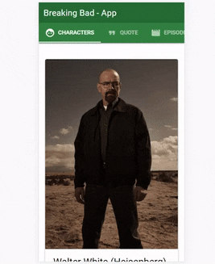

# Breaking Bad App

Breaking Bad App, that consumes [Breaking Bad API](https://breakingbadapi.com/) 🧪, listing characters, quotes and episodes.

## Used Technologies

> - Vue
> - Quasar
> - Typescript

## Todo List

> - Quote Tab
> - Episodes Tab

## Demo

[Try it here](https://hamoncordova.com.br/breaking-bad-app/)



### Install the dependencies

```bash
npm install
```

### Start the app in development mode (hot-code reloading, error reporting, etc.)

```bash
quasar dev
```

### Lint the files

```bash
npm run lint
```

### Build the app for production

```bash
quasar build
```
